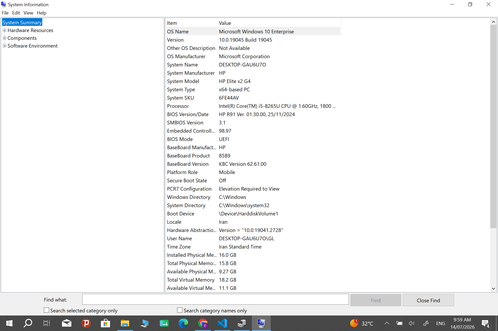
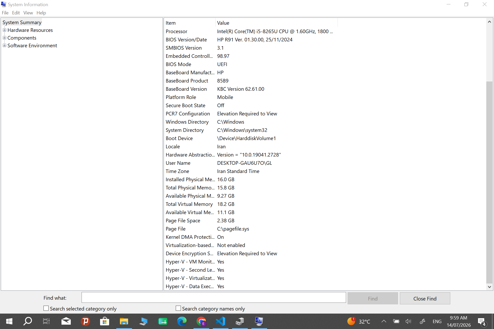

# 🖥️ PC Hardware Lab


A hands-on hardware documentation project focused on computer components, Windows system analysis, BIOS/UEFI, and hardware inspection. This repository demonstrates practical IT support knowledge through real hardware analysis and technical documentation.

---

## 📌 Table of Contents

- [Overview](#-overview)
- [Project Objectives](#-project-objectives)
- [Hardware Specifications](#-hardware-specifications)
- [Topics Covered](#-topics-covered)
- [Project Structure](#-project-structure)
- [Hardware Inspection](#-hardware-inspection)
- [Documentation](#-documentation)
- [Screenshots](#-screenshots)
- [Skills Demonstrated](#-skills-demonstrated)
- [Future Improvements](#-future-improvements)
- [License](#-license)

---

# 📖 Overview

This project documents the inspection of a real Windows computer using built-in diagnostic tools. The goal is to understand modern computer hardware, identify system components, document technical information professionally, and develop practical skills relevant to IT Support and IT-Systemelektroniker training.

---

# 🎯 Project Objectives

- Learn computer hardware fundamentals
- Inspect real hardware components
- Analyze Windows system information
- Understand BIOS / UEFI
- Document hardware professionally
- Build an IT portfolio project

---

# 💻 Hardware Specifications

| Component | Details |
|-----------|----------|
| CPU | Intel Core i5-8265U |
| RAM | 16 GB DDR4 |
| Storage | Samsung SSD |
| Operating System | Windows 11 |
| Firmware | HP BIOS / UEFI |

---

# 📚 Topics Covered

- CPU
- RAM
- Storage Devices
- BIOS / UEFI
- Boot Process
- Windows System Information
- Hardware Documentation
- Basic Hardware Troubleshooting

---

# 📂 Project Structure

```text
pc-hardware-lab/
│
├── README.md
│
├── notes/
│   ├── bios-uefi.md
│   ├── cpu.md
│   ├── ram.md
│   └── storage.md
│
├── reports/
│   └── hardware-report.md
│
├── docs/
│   ├── hardware-diagram.md
│   └── troubleshooting.md
│
└── screenshots/
```

---

# 🔍 Hardware Inspection

The hardware was inspected using Windows diagnostic tools including:

- System Information (msinfo32)
- Task Manager
- Windows Settings
- File Explorer
- Device Manager

The collected information was analyzed and documented throughout this repository.

---

# 📄 Documentation

| Document | Description |
|----------|-------------|
| `reports/hardware-report.md` | Complete technical inspection report |
| `notes/cpu.md` | CPU concepts and analysis |
| `notes/ram.md` | RAM documentation |
| `notes/storage.md` | Storage documentation |
| `notes/bios-uefi.md` | BIOS / UEFI overview |
| `docs/hardware-diagram.md` | Hardware architecture diagram |
| `docs/troubleshooting.md` | Troubleshooting scenarios |

---

# 🖼️ Screenshots

### System Information

Displays processor, installed memory, BIOS version, and operating system information.



---

### Hardware Information

Additional hardware details collected during the inspection process.



---

# 🛠️ Skills Demonstrated

- Computer Hardware Identification
- Windows System Diagnostics
- BIOS / UEFI Analysis
- Hardware Documentation
- Technical Reporting
- Hardware Inspection
- Computer Architecture
- IT Support Fundamentals
- Troubleshooting Basics

---

# ✅ Inspection Checklist

- ✔ CPU identified
- ✔ RAM verified
- ✔ Storage inspected
- ✔ BIOS documented
- ✔ Windows information collected
- ✔ Hardware report completed
- ✔ Technical documentation created

---

# 🚀 Future Improvements

Planned future additions:

- Motherboard documentation
- GPU analysis
- Hardware maintenance guide
- Boot troubleshooting scenarios
- Device Manager analysis
- SMART storage health inspection

---

# 📜 License

This repository is intended for educational and portfolio purposes.

---

## 👩‍💻 Author

**Elmira**

IT Portfolio Project | PC Hardware Documentation | 2026